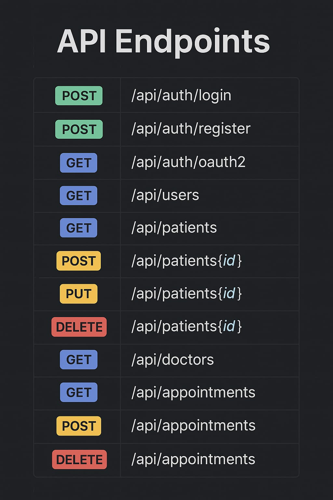

# PatientManagementSystem

## 📌 Project Description

The **Patient Management System (PMS)** is a Spring Boot-based REST API that handles secure user authentication, role-based authorization, and full CRUD for patients, doctors, and appointments. It includes robust validation, structured error responses, and seamless Google OAuth2 login.

---

## 🚀 Key Features

### 1. 🔐 Authentication & Security

- **JWT Authentication**: Stateless session handling using JSON Web Tokens (JWT).
- **OAuth2 Integration**: Google login support with automatic user registration and role assignment.
- **Role-Based Access Control (RBAC)**: Access managed via roles like `ADMIN`, `DOCTOR`, and `PATIENT` using `@PreAuthorize`.
- **Password Encryption**: Passwords are securely stored using BCrypt hashing.
- **Centralized Error Handling**: Global exception handler provides consistent and user-friendly error messages.

---

### 2. 👥 User Management

- **Registration & Login**: Endpoints for email/password login and OAuth2-based login.
- **Role Assignment**: Roles assigned during registration or via database seeders.
- **Validation**: Unique email and valid phone formats enforced.

---

### 3. 🧑‍⚕️ Patient Management

- **CRUD Operations**: Create, view (with pagination), update, and delete patient records.
- **Search & Filter**: Search patients by disease with case-insensitive queries.
- **Doctor Assignment**: Assign doctors to patients during creation or update.

---

### 4. 👨‍⚕️ Doctor Management

- **CRUD Operations**: Create and manage doctor profiles.
- **Patient Association**: View list of patients assigned to each doctor.

---

### 5. 📅 Appointment Management

- **Scheduling**: Book and schedule appointments between patients and doctors.
- **Filtering**: Retrieve appointments by patient, doctor, or by date range.
- **Cancellation**: Cancel or update appointment status with clear feedback.

---

### 6. 🧬 Entities & Relationships

- **JPA Modeling**: Full relational structure with `User`, `Role`, `Patient`, `Doctor`, and `Appointment` entities.
- **Relationship Mapping**:
  - `User ↔ Role`: Many-to-many
  - `Doctor → Patients`: One-to-many
  - `Appointment → Patient/Doctor`: Many-to-one
- **Validation**: Jakarta annotations used to enforce data formats and constraints.

---

### 7. 🧩 Repository & Data Access

- **Spring Data JPA**: Repository interfaces with custom query methods for business logic.
- **Pagination & Sorting**: All list endpoints support pagination and sorting out of the box.

---

### 8. ⚙️ Configuration & Initialization

- **SecurityConfig.java**: Central place for configuring JWT filter chains, OAuth2 user service, and URL access policies.
- **Role Seeder**: Ensures essential roles (`ADMIN`, `DOCTOR`, `PATIENT`) exist at startup.

---

### 9. 📡 API Design

- **RESTful Design**: Standard HTTP methods for all entity endpoints.
- **Validation Feedback**: All errors return clean, structured JSON with field-specific messages.
- **Consistent JSON Format**: Success and error responses follow a consistent pattern across the app.

 ### 📡 API Endpoints Overview

